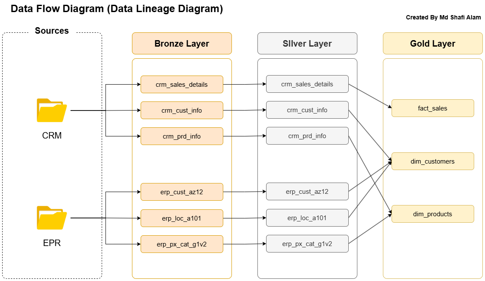

# 📊 SQL Data Warehousing Project

---

## 🎥 Presentation Video
👉 *(Coming Soon)*

---

## 🚀 Project Overview

This project focuses on designing and implementing a **modern SQL-based data warehouse** using industry-standard architectural principles and best practices.

The core components of this project include:

### 1️⃣ Data Architecture  
Designed a structured data warehouse using the **Medallion Architecture**, consisting of:
- **Bronze Layer** – Raw ingestion layer storing source data in its original format  
- **Silver Layer** – Cleansed and transformed layer ensuring data quality and consistency  
- **Gold Layer** – Business-ready analytical layer with fact and dimension tables optimized for reporting and decision-making  

This layered architecture ensures scalability, maintainability, and clear data lineage across transformation stages.

---

### 2️⃣ ETL Pipelines  
Developed structured ETL workflows to:
- Extract data from multiple source systems (CRM & ERP)
- Perform cleansing, standardization, and integration
- Load transformed data into curated analytical tables

Each layer was engineered using a **truncate-and-load strategy**, meaning:
- Tables are fully refreshed during each load cycle
- No incremental loading logic is implemented
- Ensures data consistency and simplifies pipeline design

---

### 3️⃣ Data Modeling  
Designed analytical data models including:
- Optimized **fact tables**
- Structured **dimension tables**
- Star-schema modeling approach for performance efficiency

The final Gold layer supports fast, reliable analytical queries tailored for business intelligence use cases.

---

## 🎯 Objectives

- Designed and engineered an **end-to-end MySQL data warehouse** using the Medallion Architecture (Bronze, Silver, Gold).  
- Integrated ERP and CRM CSV datasets into a centralized, analytics-ready structure.  
- Built ETL workflows using a **truncate-and-load methodology** (not incremental load) to ensure data refresh consistency at every stage.  
- Performed data cleansing, validation checks, and schema standardization to improve data quality.  
- Developed optimized fact and dimension tables to enhance analytical query performance.  
- Improved reporting efficiency and structured decision-support capabilities.

---

## 🗂️ Datasets Used

The project integrates structured CSV datasets from two independent source systems:

### 📁 Source Systems

#### 🔹 CRM System (`source_crm`)
Contains 3 CSV files:
- `cust_info`
- `prd_info`
- `sales_details`

#### 🔹 ERP System (`source_erp`)
Contains 3 CSV files:
- `CUST_AZ12`
- `LOC_A101`
- `PX_CAT_G1V2`

These datasets were consolidated, standardized, and transformed through Bronze, Silver, and Gold layers to build a unified analytics warehouse.

---

## 🔄 Data Lineage Diagram

<!-- Insert Data Lineage Image Below -->

*Figure: End-to-end data lineage from source systems to analytical Gold layer*

---

## 🏗️ Data Architecture (Medallion Architecture)

<!-- Insert Medallion Architecture Image Below -->

*Figure: Medallion Data Warehousing Architecture (Bronze → Silver → Gold Layers)*

---

## 🙌 Data Credits

Special thanks to **Baraa Khatib Salkini** for providing the dataset used in this project.  
Data Source: https://github.com/DataWithBaraa

---
